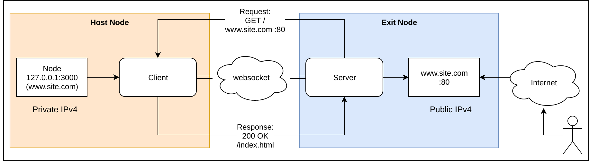

# inlets

Expose your local endpoints to the Internet

## Intro

inlets combines a reverse proxy and websocket tunnels to expose your internal and development endpoints to the public Internet via an exit-node. An exit-node may be a 5-10 USD VPS or any other computer with an IPv4 IP address.

Why do we need this project? Similar tools such as ngrok or Argo from CloudFlare are expensive and closed-source. Ngrok is also often banned by corporate firewall policy. Other open-source tunnel tools are designed to only set up a static tunnel. inlets aims to dynamically bind and discover your local services to DNS entries with automated TLS certificates to a public IP address over its websocket tunnel.

When combined with SSL - inlets can be used with any corporate HTTP proxy which supports `CONNECT`.



Initial goals:

* automatically create endpoints on exit-node based upon client definitions
  * multiplex sites on same port through use of DNS / host entries 
* link encryption using SSL over websockets (`wss://`)
* automatic reconnect
* authentication using service account or basic auth
* automatic TLS provisioning for endpoints using [cert-magic](https://github.com/mholt/certmagic)
  * configure staging or production LetsEncrypt issuer using HTTP01 challenge

Stretch goals:

* discover and configure endpoints for Ingress definitions from Kubernetes
* configuration to run "exit-node" as serverless container with Azure ACI / AWS Fargate
* automatic configuration of DNS / A records
* configure staging or production LetsEncrypt issuer using DNS01 challenge

Non-goals:

* tunnelling plain (non-HTTP) traffic over TCP

## Status

Unlike HTTP 1.1 which follows a synchronous request/response model websockets use an asynchronous pub/sub model for sending and receiving messages. This presents a challenge for tunneling a synchronous protocol over an asynchronous bus. This is a working prototype that can be used for testing, development and to generate discussion, but is not production-ready.

* There is currently no authentication on the server component
* The default configuration uses websockets without SSL `ws://`, but to enable encryption you could enable SSL `wss://`
* There is no timeout for when the tunnel is disconnected
* The upstream URL has to be configured on both server and client until a discovery or service advertisement mechanism is added

Contributions are welcome. All commits must be signed-off with `git commit -s` to accept the [Developer Certificate of Origin](https://developercertificate.org).

Binaries for Linux, Darwin (MacOS) and armhf are made available via the [releases page](https://github.com/alexellis/inlets/releases)

## Test it out

You will need Golang 1.10 or 1.11 on both the exit-node or server and the client.

* On the server or exit-node

Start the tunnel server on a machine with a publicly-accessible IPv4 IP address such as a VPS.

```
go get -u github.com/alexellis/inlets
cd $GOPATH/src/github.com/alexellis/inlets

go run -server=true -port=80 -upstream=http://127.0.0.1:3000
```

Note down your public IPv4 IP address i.e. 192.168.0.101

* On your dev machine start an example service

This service generates hashes and is an example we want to share online

```
go get -u github.com/alexellis/hash-browns
cd $GOPATH/src/github.com/alexellis/hash-browns

port=3000 go run server.go 
```

* On your dev machine

Start the tunnel client

```
go get -u github.com/alexellis/inlets
cd $GOPATH/src/github.com/alexellis/inlets

go run -server=false -remote=192.168.0.101:80 -upstream=http://127.0.0.1:3000
```

Finally with an example server running and a tunnel server and a tunnel client send a request to the public IP address i.e.:

```
curl -d "hash this" http://192.168.0.101/hash
```

You will see the traffic pass between the exit node / server and your development machine. You'll see the hash message appear in the logs as below:

```
~/go/src/github.com/alexellis/hash-browns$ port=3000 go run server.go 
2018/12/23 20:15:00 Listening on port: 3000
"hash this"
```

Now check the metrics:

```
curl http://192.168.0.101/metrics | grep hash
```

* Try something else

You can expose an OpenFaaS or OpenFaaS Cloud deployment with `inlets` - just change `-upstream=http://127.0.0.1:3000` to `-upstream=http://127.0.0.1:8080` or `-upstream=http://127.0.0.1:31112`. You can even point at an IP address inside or outside your network for instance: `-upstream=http://192.168.0.101:8080`.

You can build a basic supervisor script for `inlets` in case of a crash, it will re-connect within 5 seconds:

In this example the Host/Client is acting as a relay for OpenFaaS running on port 8080 on the IP 192.168.0.28 within the internal network.

Host/Client:

```
while [ true ] ; do sleep 5 && ./inlets -server=false -upstream=http://192.168.0.28:8080 -remote=exit.my.club  ; done
```

Exit-node:

```
while [ true ] ; do sleep 5 && ./inlets -server=true -upstream=http://192.168.0.28:8080 ; done
```
